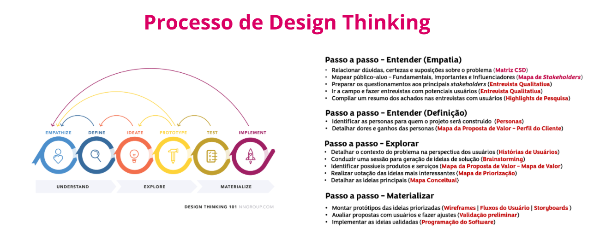
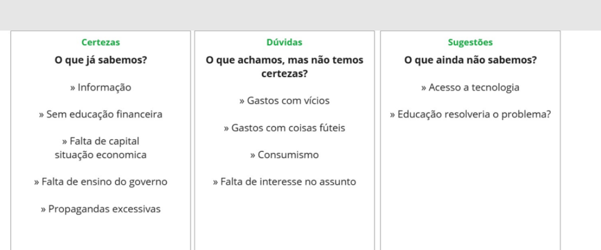
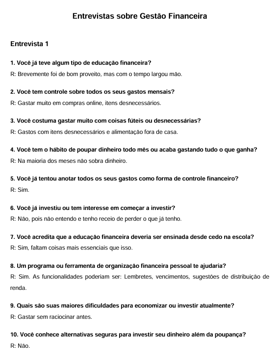
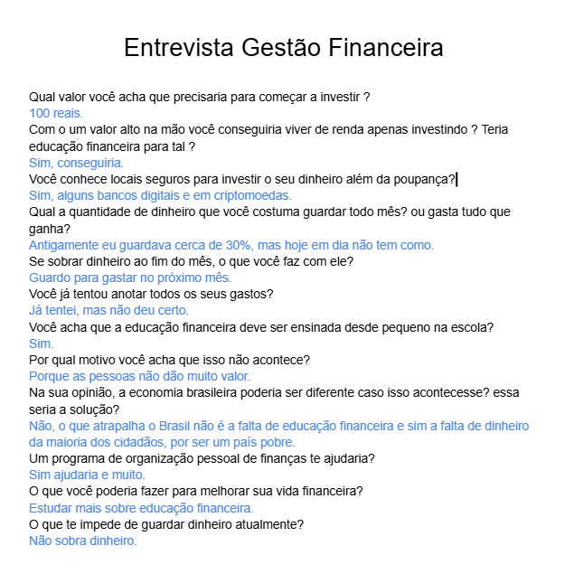
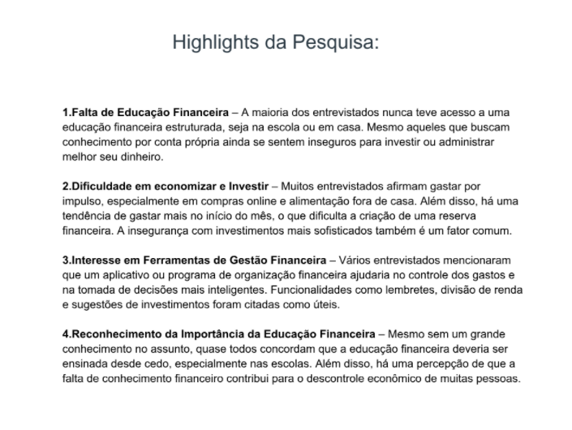
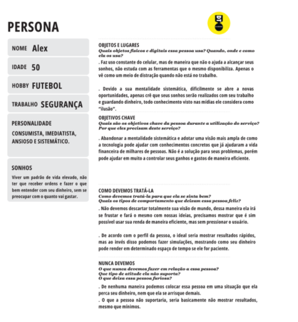
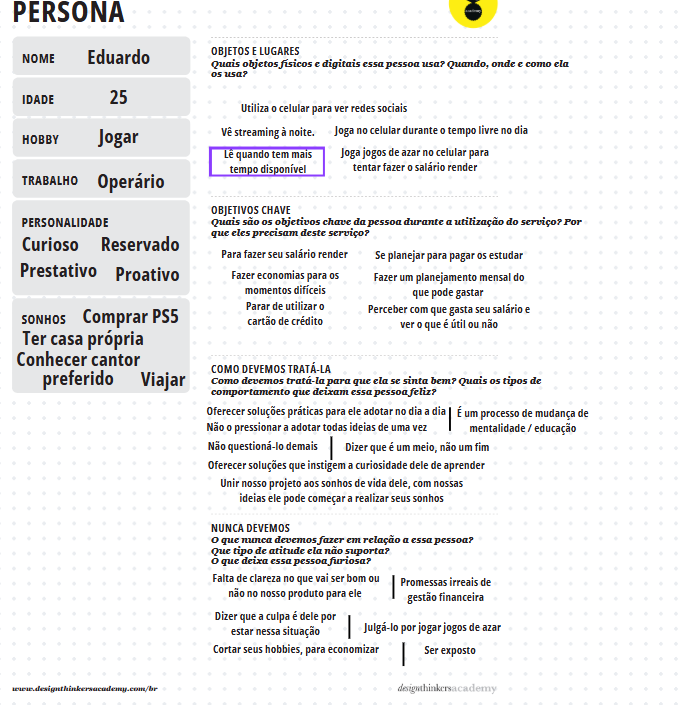
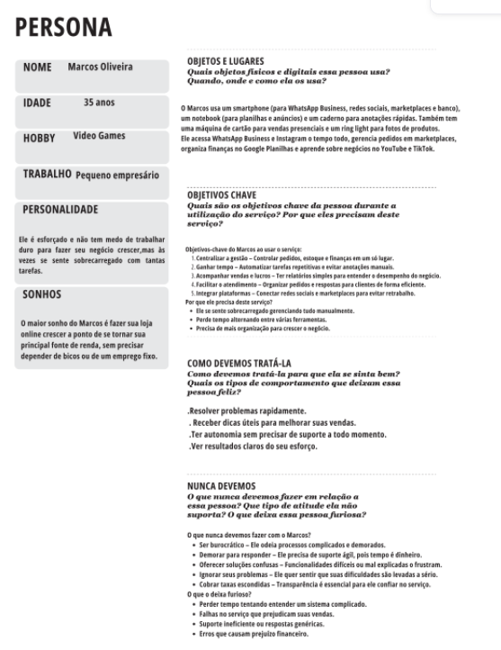

# Product discovery

Pré-requisitos: <a href="01-Contexto.md"> Documentação de contexto</a>

✅ 

## Etapa de entendimento

> * **Matriz CSD**:
Nessa matriz falamos sobre as informações que identificamos do problema, o que não temos certeza e o que precisamos descobrir.
Todo o grupo concorda com a falta de educação financeira é um dos maiores problemas.

# Matriz para destrinchar as suposições do problema

> * **Mapa de stakeholders**:
Nessa etapa, tentamos identificar quem seriam todas as pessoas envolvidas na nossa solução proposta, desde os que não atuam diretamente e que poderiam somente fornecer informações ou coleta de dados, até os clientes finais / pessoas mais afetadas.

# Mapa de pessoas importantes
# 

> * **Entrevistas qualitativas**:
Nessa etapa fizemos diversas entrevistas com pessoas diferentes, pelo menos 1 pessoa por integrante do grupo e selecionamos as que renderam melhores informações.

# Entrevista 1

# Entrevista 2

# Entrevista 3

> * **Highlights de pesquisa**: 
Aqui mostramos os principais resultados obtidos em todas as entrevistas feitas.
Essas entrevistas forneceram informações importantes para nossa solução, onde estão as principais lacunas sobre educação financeira e quais são as áreas mais importantes para os entrevistados.

## Etapa de definição

### Persona
Nessa etapa tentamos identificar quem seriam os mais afetados pelos problemas e, seus objetivos, sonhos, trabalho, dia-a-dia, tudo que pudesse fornecer informações relevantes para nosso trabalho.
# Persona Alex

# Persona Eduardo

# Persona Marcos
