# Projeto de interface

Pré-requisitos: <a href="03-Product-design.md"> product design</a>

 Visão geral da interação do usuário pelas telas do sistema e protótipo interativo das telas com as funcionalidades que fazem parte do sistema (wireframes).

 Apresente as principais interfaces da plataforma. Discuta como ela foi elaborada de forma a atender os requisitos funcionais, não funcionais e histórias de usuário abordados na parte de <a href="03-Product-design.md"> product design</a>.

 ## User flow

## Wireframes
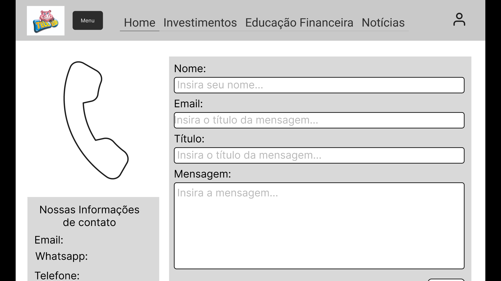
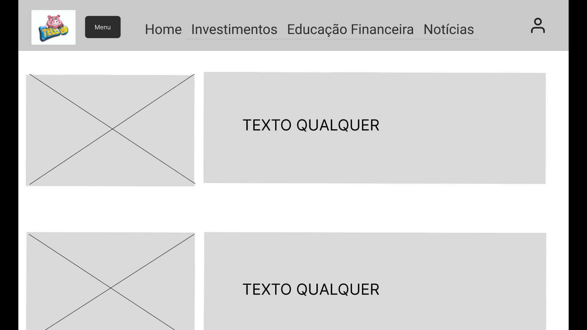
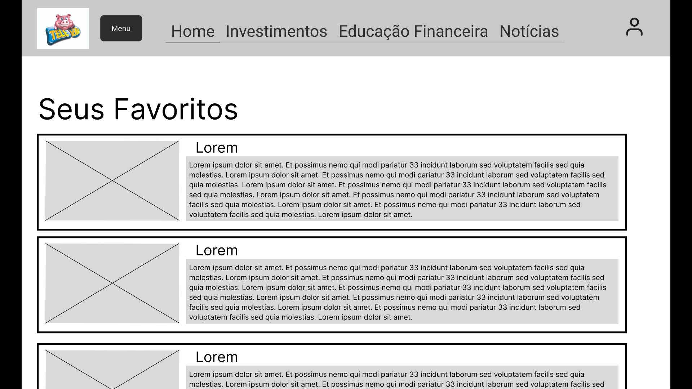 
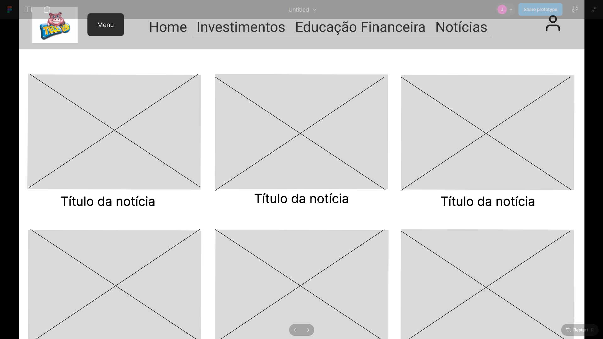 
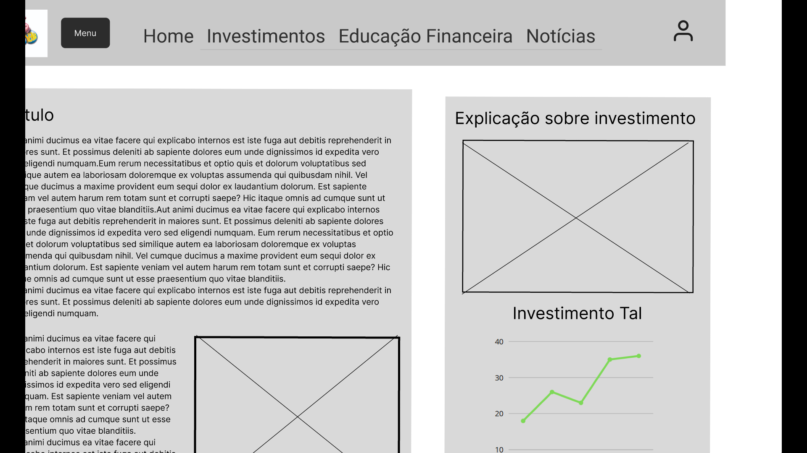
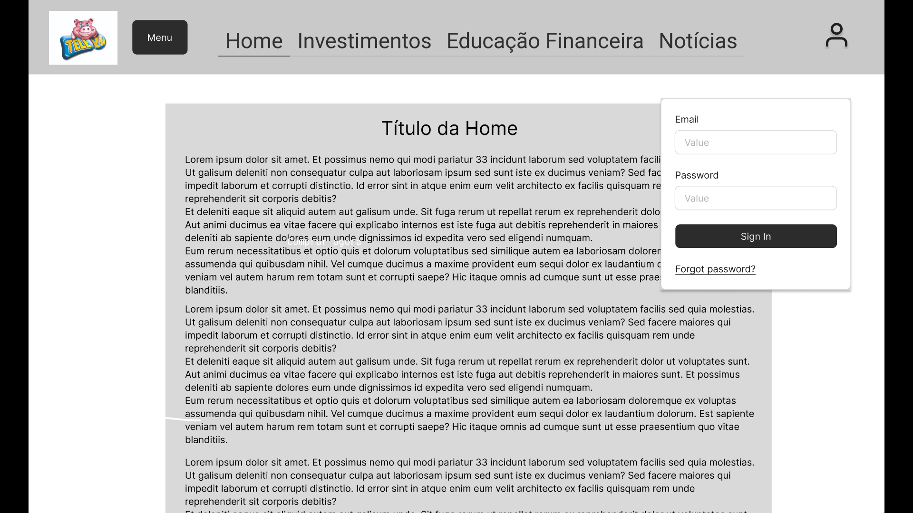 
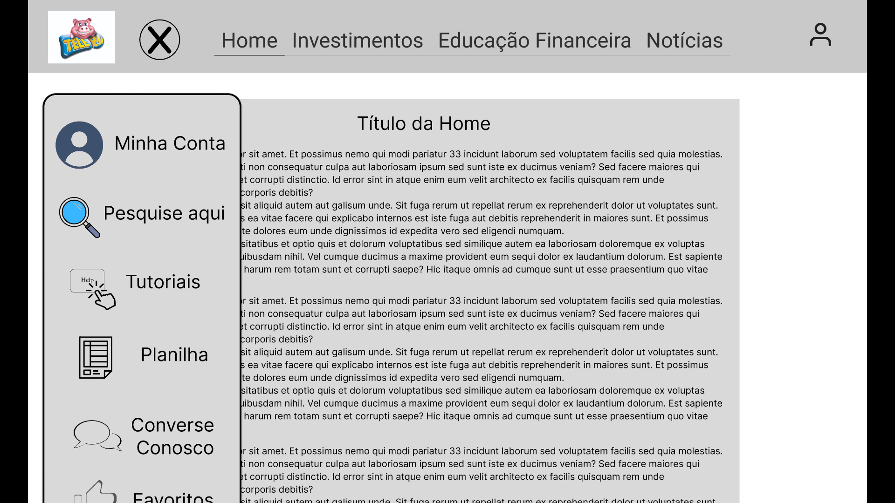
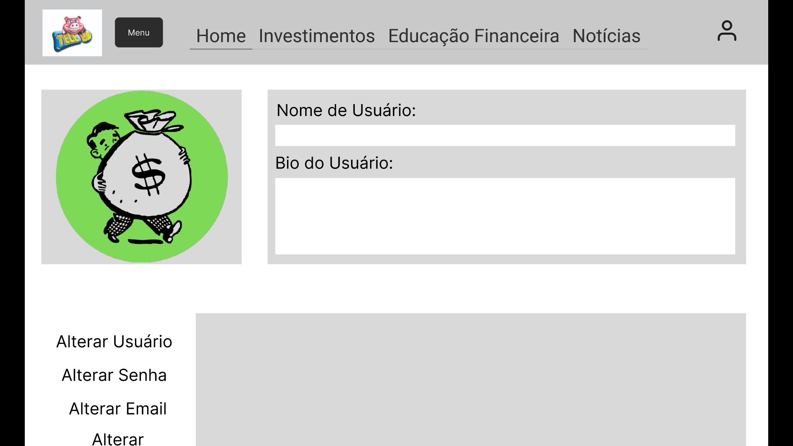
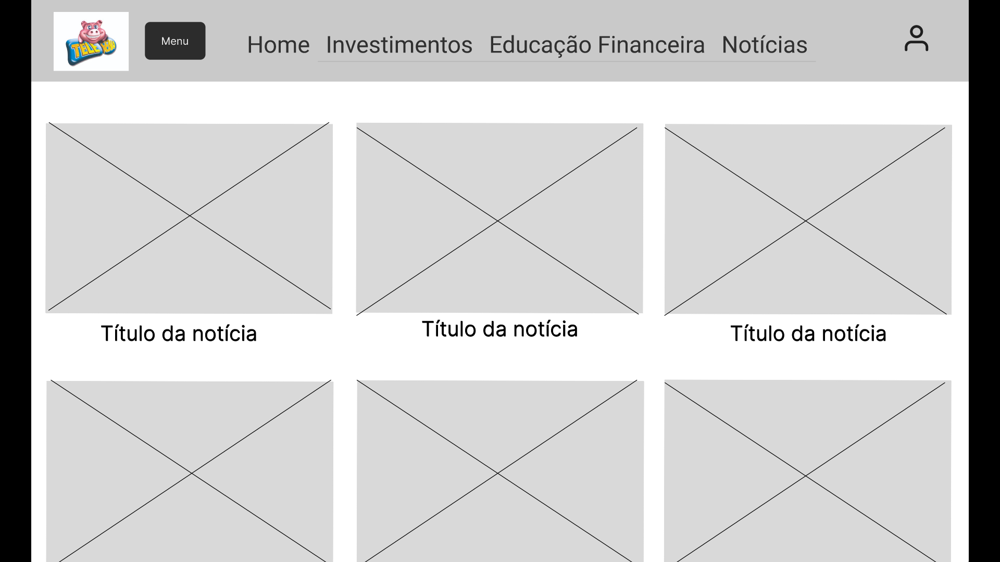 
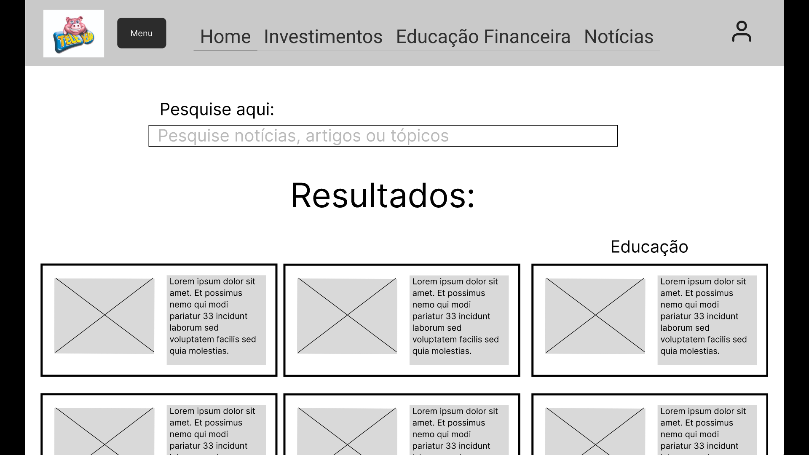
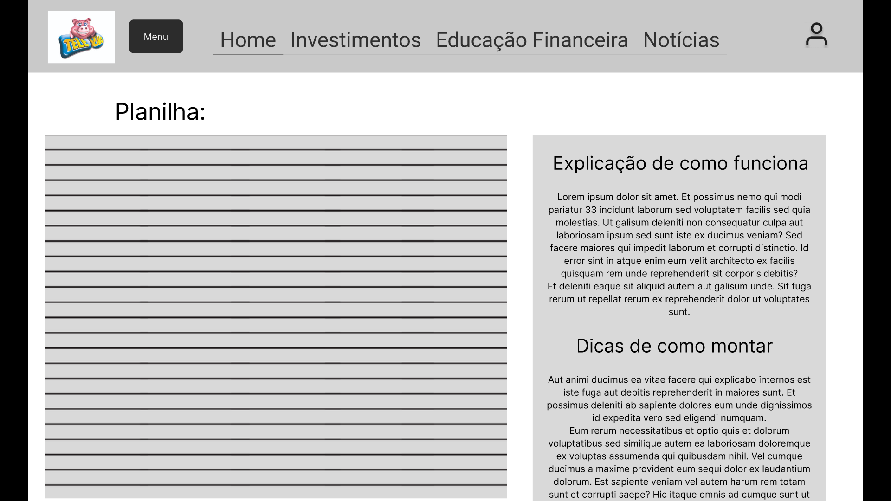
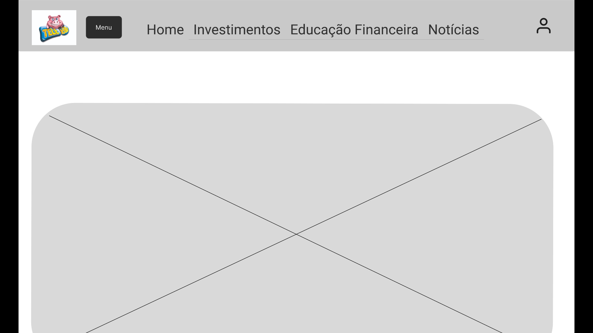

### Protótipo Interativo
A interface do site foi produzida de tal forma em que seja interativa e de facil entedimento do usuário, com menus interativos, diferentes páginas 
(Home, Investimentos, Educação Financeira, Notícias):
Criamos também um Menu para o usúario com as abas:
Minha Conta, Tutorias, Planilha, Converse Conosco e Favoritos. 
Como é somente o wireframe ainda, a página esta disposta a mudanças para melhorar ainda mais a interface do site para melhor atender os usuários!

Link do Protótipo Interativo;
https://www.figma.com/proto/iFd1rVM6CzKLPw3paVsfcI/Untitled?node-id=41-127&p=f&t=wJ2wGQpQ2OGHm5to-1&scaling=min-zoom&content-scaling=fixed&page-id=0%3A1&starting-point-node-id=41%3A127